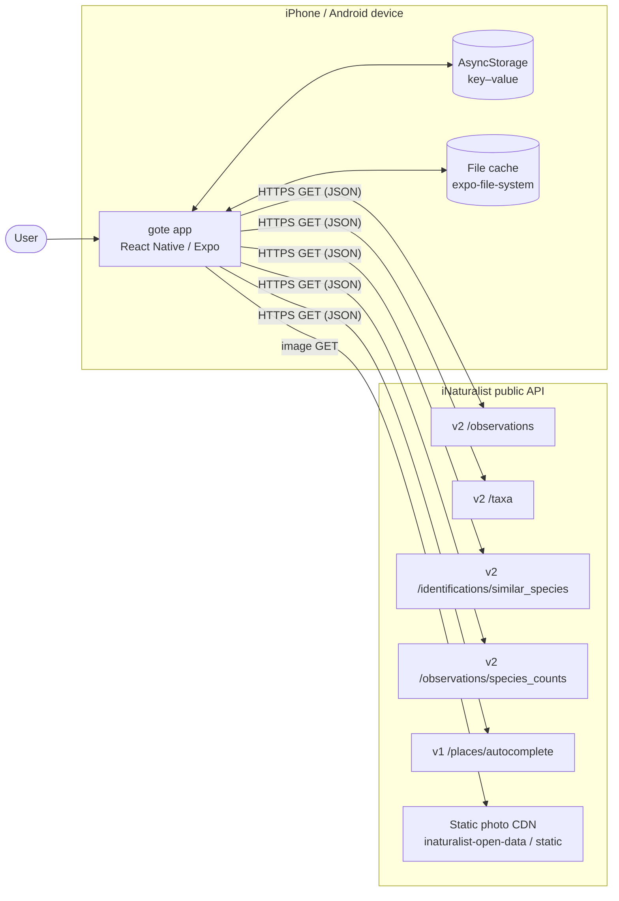
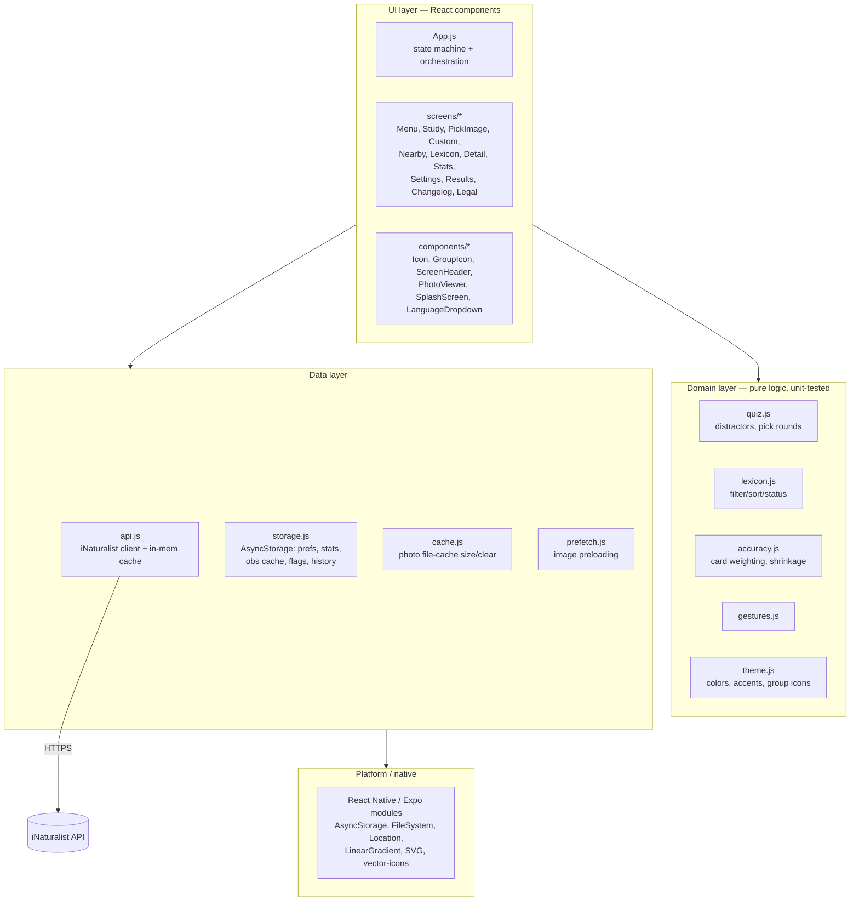
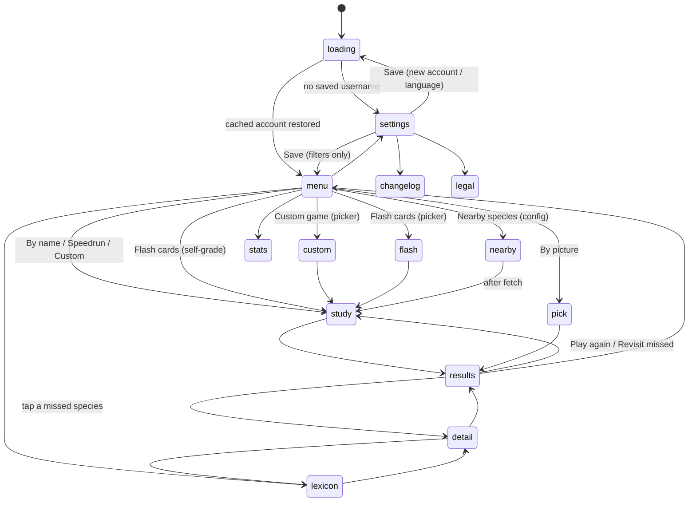
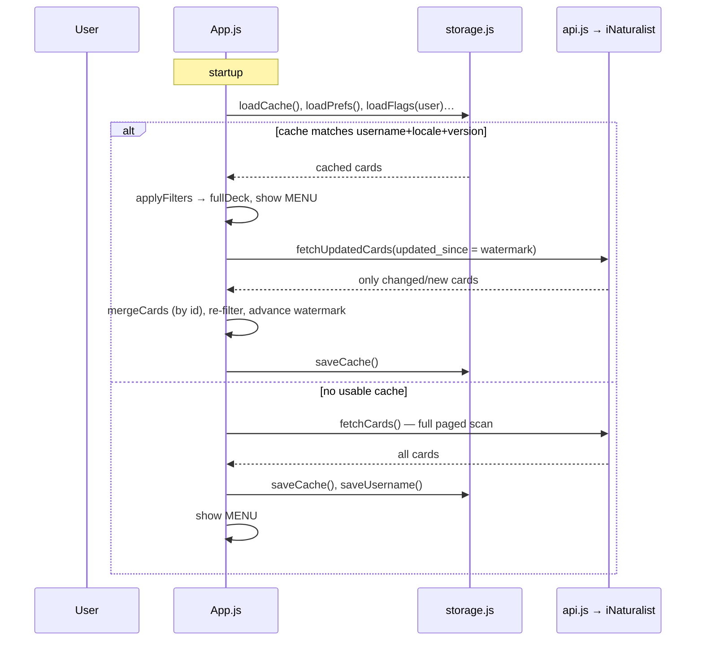
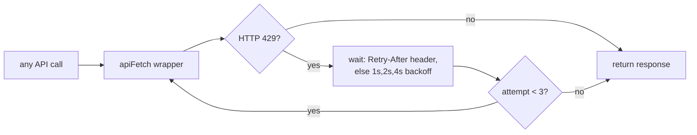
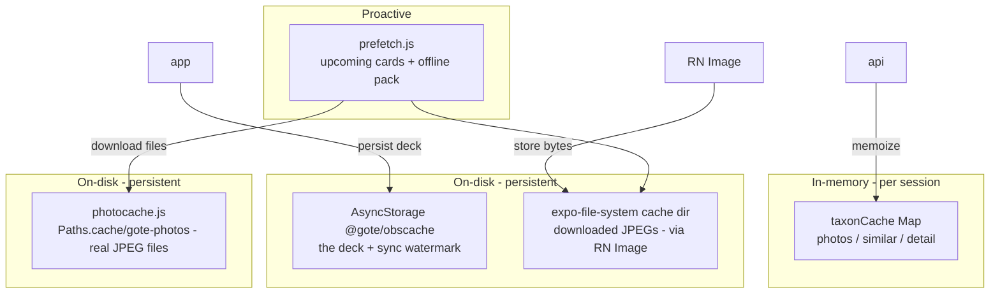
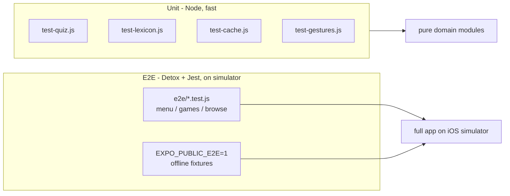

# gote — Architecture & Technical Overview

gote is an offline-friendly flashcard game that turns a person's **iNaturalist**
observations into species-identification quizzes. This document describes the
high-level architecture, the runtime data flow, the external APIs it consumes,
and the caching/persistence model.

- **Platform:** Expo SDK 54 · React Native 0.81.5 · React 19.1
- **Architecture:** New Architecture (Fabric) enabled, Hermes engine
- **Native generation:** CNG — `ios/` & `android/` are generated by `expo prebuild` (gitignored)
- **No backend of our own:** all data comes from the public iNaturalist API; all state is on-device
- **License:** AGPL-3.0-only

---

## 1. System context



gote is a **thin client over the iNaturalist API**. There is no gote server,
no account system, and no telemetry by default. Everything the app needs is
fetched by public username and cached locally.

---

## 2. Layered architecture



**Design rules**

- **`App.js` is the brain.** It owns all cross-screen state and is a small
  hand-rolled state machine (no navigation library). Screens are presentational
  and receive data + callbacks as props.
- **Domain logic is pure and tested.** `quiz.js`, `lexicon.js`, `gestures.js`
  have no React/Native imports and are covered by Node unit tests
  (`scripts/test-*.js`).
- **The network is isolated in `api.js`.** Every request goes through one
  `apiFetch` wrapper (429 backoff) and every taxon lookup goes through one
  in-memory cache.

---

## 3. Screen flow (state machine)

`App.js` holds a single `screen` string and swaps the rendered screen on it.



**Game-mode → engine mapping**

| Menu item        | `mode`     | Screen            | Interaction                                  |
|------------------|------------|-------------------|----------------------------------------------|
| By name    | `all`      | `StudyScreen`     | Multiple choice (name options)               |
| By picture     | `pick`     | `PickImageScreen` | Multiple choice (photo tiles)                |
| Speedrun         | `speedrun` | `StudyScreen`     | Multiple choice, endless, 3 lives            |
| Nearby species   | `nearby`   | `StudyScreen`     | Multiple choice (place-typical deck)         |
| Custom game      | `custom`   | `StudyScreen`     | Multiple choice (filtered deck)              |
| Flash cards      | `flash`    | `StudyScreen`     | Self-grade (reveal → "knew it / missed it")  |

`StudyScreen` is one component with two grading styles (`choiceMode` vs.
self-grade). Multiple-choice distractors come from `quiz.pickSimilarDistractors`
(taxonomically similar species via shared ancestry). `PickImageScreen` rounds
are built by `quiz.buildPickRound` from curated photos.

---

## 4. Data model

The core entity is a **card** (one observation, or one place-typical species):

```js
{
  id,           // observation id ("obs-…") or "taxon-<id>" for Nearby
  taxonId,      // iNaturalist taxon id (stable species key)
  image,        // medium photo URL
  attribution,  // "(c) Name, CC BY-NC" — shown on the card
  licenseCode,  // e.g. "cc-by-nc"
  common,       // sentence-cased common name (locale-dependent) | null
  scientific,   // binomial / taxon name
  rank,         // "species", "subspecies", …
  rankLevel,    // numeric depth: species=10, subspecies<10, genus>10
  iconic,       // iconic taxon: "Aves", "Plantae", … (group key)
  ancestry,     // ordered kingdom→species ancestor ids (distractor similarity)
  observedOn,   // ISO date
  updatedAt,    // server last-modified (incremental sync watermark)
  qualityGrade, // "research" | "needs_id" | "casual" (research-grade filter)
}
```

### On-device persistence (AsyncStorage, `storage.js`)

| Key                       | Shape                                                          | Purpose |
|---------------------------|----------------------------------------------------------------|---------|
| `@gote/username`          | string                                                         | Last account |
| `@gote/prefs`             | `{ perSpecies, locale, researchGrade, speciesOnly, namedOnly, freshPhotos, themeMode }`| Study options + theme |
| `@gote/stats`             | `{ answered, correct }`                                        | Lifetime totals |
| `@gote/tutorial`          | `{ status: 'new' \| 'running' \| 'done', step }` | Guided-tour progress. Device-local and never synced — "have I been shown around THIS phone" is a property of the device, not the account. Survives a statistics reset |
| `@gote/species`           | `{ [taxonId]: { name, sci, image, known, missed, lastSeen, msTotal, msCount } }` | Per-species tallies (Stats, Lexicon status). `lastSeen`/`msTotal`/`msCount` added 2026-08-08 — retrieval signals nothing reads yet, banked because that history can't be backfilled (`src/recall.js`). Synced via the events `species` delta |
| `@gote/confusions`        | `{ [correctKey]: { [chosenKey]: count } }`                    | Confusion matrix — species the player mixes up (synced via the events `confusions` delta) |
| `@gote/confusionNotes`    | `{ [pairKey]: { text, t } }`                                 | Player's "my tell" notes for confused pairs. Synced via the settings payload as `n:<pairKey>` keys, merged per note by `t` (last edit wins; empty text = tombstone). `displayNotes` gives the UI's `{ pairKey: text }` |
| `@gote/confusionWins`     | `{ [pairKey]: streak }`                                       | "Verify the fix" recovery streaks — consecutive correct answers on a former-nemesis pair, reset on relapse (device-local) |
| `@gote/history`           | `number[]` (accuracy %, oldest→newest, cap 120)               | Menu accuracy chart |
| `@gote/historyCounts`     | `number[]` (cards per round, **right-aligned** with `history`) | Weights for every aggregate over the chart (`accuracy.js`). Shorter than `history` for rounds played before 2.37.0 — those read as "size unknown". Synced via the events `n` / `counts` fields |
| `@gote/streak`            | `{ count, longest, … }`                                       | Daily streak |
| `@gote/activeDays`        | `string[]` (YYYY-MM-DD)                                        | Days played — the streak's source of truth |
| `@gote/flags`             | `{ [username]: { [taxonId]: { on, t } } }`                    | Flagged species, **per account**. Synced via the settings payload as `f:<username>:<taxonId>` keys, merged per flag by `t` (last toggle wins; on:false = tombstone). `loadFlags` gives the flagged-id list the UI reads |
| `@gote/obscache`          | `{ version, username, locale, cards[], watermark, syncedAt }`  | Offline deck cache |
| `@gote/downloadedImages`  | `string[]` (photo URLs, capped 1500)                          | **Retired 2026-08-01.** Was the offline-deck filter; the filesystem is the truth now (`photocache.js`, §7). Cleared once on startup and no longer consulted |
| `@gote/settingsStamp`     | number (ms epoch)                                             | Last local settings change — cross-device sync LWW |
| `@gote/dataVersion`       | number                                                        | Local data-shape version — forward migrations |
| `@gote/watchResultIds`    | `string[]` (dedup ledger, cap 500)                           | Applied watch-result ids |
| `@gote/watchTipDismissed` | boolean                                                       | Watch tip dismissed |

`CACHE_VERSION` (currently **5**) guards `@gote/obscache`: a card-shape change
bumps it and forces a fresh full download. Flags/history/stats live under
separate keys, so they survive cache-version bumps and "Empty cache".

`DATA_VERSION` (currently **1**) versions the on-device shapes as a whole;
`runDataMigrations()` upgrades them forward once at launch. It is distinct from
`CACHE_VERSION` (the disposable deck cache) and from the network payload versions
— all three are tracked in [`SCHEMA-CHANGELOG.md`](SCHEMA-CHANGELOG.md).

---

## 5. Account loading & incremental sync

The deck is loaded once and then **incrementally synced** using each
observation's `updated_at` as a watermark, so repeat launches are instant and
cheap.



- **Filters are local.** `perSpecies`, `researchGrade`, `speciesOnly` are applied
  in memory by `applyFilters(rawCards, prefs)` — toggling them never re-downloads.
  Changing **username or language** does trigger a reload (language changes the
  common names, which are fetched per `locale`).
- **`mergeCards`** unions by `id`, sorts by `observedOn` desc, caps at
  `MAX_CACHE` (1000).

---

## 6. iNaturalist API reference

Base hosts: `https://api.inaturalist.org/v2` (most) and `…/v1` (places only).
All calls are unauthenticated GETs. The app identifies itself with a
`User-Agent`.

> **v2 `fields` gotcha:** the v2 API returns only a `uuid` unless you pass a
> `fields` parameter — a URL-encoded JSON object selecting exactly the fields
> (and nested fields) you want. Each call sends a tailored `FIELDS_*` selection
> to keep responses small.

| # | Endpoint | Used by | Key params | Returns |
|---|----------|---------|------------|---------|
| 1 | `GET /v2/observations` | `fetchCards`, `fetchUpdatedCards` | `user_id`, `photos=true`, `per_page=200`, `page`, `order_by=observed_on\|updated_at`, `order=desc`, `locale`, `updated_since`, `fields` | User's observations → cards |
| 2 | `GET /v2/taxa/{ids}` | `fetchTaxonPhotos`, `fetchTaxonPhotosByIds`, `fetchTaxonDetail` | comma ids (≤30), `locale`, `per_page`, `fields` | Curated photos, taxonomy, wiki summary |
| 3 | `GET /v2/identifications/similar_species` | `fetchSimilarSpecies` | `taxon_id`, `locale`, `fields` | Commonly-confused taxa (distractors) |
| 4 | `GET /v2/observations/species_counts` | `fetchNearbyCards` | `lat`, `lng`, `radius`, `quality_grade=research`, `hrank=species`, `iconic_taxa`, `per_page`, `page`, `locale`, `fields` | Place-typical species (most common first) |
| 5 | `GET /v1/places/autocomplete` | `searchPlaces` | `q`, `per_page` | Named places + coordinates |
| — | Photo CDN | `<Image>` / `prefetch` | size in URL (`square\|small\|medium\|large`) | JPEG bytes |

### Rate limiting & resilience



iNaturalist caps clients at ~**60 requests/minute**. Mitigations:

- **Single choke point:** every request goes through `apiFetch`, which retries
  `429` up to 3× honoring `Retry-After`.
- **In-memory taxon cache** (`taxonCache` Map, keys `photos:`/`similar:`/`detail:`):
  per-taxon results are stable, so they're memoized for the session (cleared on
  language change). This makes "By picture" (several taxa per round) cheap on
  repeats.
- **Gameplay makes zero network calls** in the photo/self-grade modes — rounds
  run off the cached deck and pre-fetched images.

---

## 7. Caching layers

There are four distinct caches, each at a different layer:



| Cache | Module | Lifetime | Cleared by |
|-------|--------|----------|------------|
| Taxon lookups | `api.js` (`taxonCache`) | App session | Language change (`clearTaxonCache`) |
| Observation deck | `storage.js` (`@gote/obscache`) | Persistent | New account/locale, `CACHE_VERSION` bump |
| Photo bytes | OS / RN Image (`expo-file-system`) | Persistent | Settings → "Empty" (`cache.js`) |
| Upcoming images (speed only) | `prefetch.js` (`Image.prefetch`) | App session (requests) | — (fire-and-forget) |
| Offline photo pack | `photocache.js` (`Paths.cache/gote-photos`) | Persistent (OS-reclaimable) | Settings → "Empty" (`clearPhotoCache`) |

**Offline pack.** The two jobs are deliberately *different mechanisms*.
`Image.prefetch` warms the OS cache for the next few cards — a pure speed
optimisation, never counted as offline-ready, because that cache evicts silently
and cannot be queried. The pack itself is **real files** written by
`photocache.js`; `prefetchDeck()` fills a capped slice (1000 cards, ≈280 MB at
~280 KB/photo) in the background after each **online** deck load, and
`prefetchUpcoming()` files cards in as they are played. Offline,
`isCached()` lets the app play only cards whose photos genuinely exist on disk
(see §8) — the previous manifest-of-attempted-prefetches served cards whose
photos the OS had quietly discarded, producing a round of grey placeholders.

---

## 8. Cross-cutting concerns

- **Theming & icons** (`theme.js`): a "Minimal" design — one green palette + an
  `accents` set used as accent-coloured icon tints over flat, hairline-divided
  lists. UI glyphs use **Ionicons** (via `components/Icon.js`, which maps
  legacy Feather-style names → Ionicons). Taxon-group glyphs use
  **MaterialCommunityIcons** with a **FontAwesome5** fallback for the frog
  (`components/GroupIcon.js`).
- **Localization:** only the *species names* are localized (per the iNaturalist
  `locale`); the app UI is English. Supported locales mirror iNaturalist's
  (`constants.js → LANGUAGES`).
- **Connectivity & offline** (`net.js` → `useIsOffline`): a conservative,
  NetInfo-backed flag (offline only on an explicit `isConnected === false`;
  forced off in the E2E/SHOTS modes). It gates the features that genuinely need
  a live API call — **Nearby** (a place query) and **By picture** (curated
  photos per round) are disabled offline. The deck-local modes (By name,
  Speedrun, Custom, Flash) keep working: `App.js` derives a `playableDeck` by
  filtering the deck to downloaded photos (the §7 manifest), so no round shows a
  blank card. An `OfflineBanner` explains the state, and an empty state ("connect
  once to load your deck") shows when nothing is downloaded yet.
- **Cross-device sync & data versioning** (`src/sync/*`): optional, strictly
  opt-in Supabase sync — an **append-only `events` log** for stats and confusions
  (union-merged, so concurrent devices can't clobber each other) and a **last-write-wins
  settings blob**. Payloads carry a version marker and are upcast on read; the
  database shallow-merges the settings blob so an older client can't erase a key
  it doesn't know. Off by default and absent from credential-less builds. Full
  record in [`SCHEMA-CHANGELOG.md`](SCHEMA-CHANGELOG.md) and
  [`SUPABASE.md`](SUPABASE.md).
- **Monitoring:** none. The app ships without any crash/error-reporting SDK, so
  no telemetry leaves the device. (A no-op Sentry wrapper was removed; it can be
  re-added behind a DSN later if wanted.)
- **Feedback/bug reports** (Settings): a pre-filled GitHub issue URL and a
  `mailto:` — no in-app network needed.

---

## 9. Testing



- **Unit tests** (`npm test`): pure domain logic, ESM transpiled in-memory. ~415
  assertions across quiz, lexicon, cache, gestures, sync/merge, confusions,
  duel, verify, schedule, mastery, accuracy, navigation, study-photo, watch
  storage and contrast.
- **Sync integration** (`npm run test:sync`): the real client against a local
  Supabase (Docker), covering RLS, idempotency and two-device merges. Run
  `npx supabase db reset` after adding a migration — `supabase start` only
  applies migrations when it first creates the database.
- **E2E tests** (`npm run e2e:build && npm run e2e:test`): Detox drives the real
  app on the iOS simulator. To stay deterministic and offline, a build with
  `EXPO_PUBLIC_E2E=1` (`src/e2e/testMode.js`) short-circuits **every** network
  call in `api.js` to fixtures (`src/e2e/fixtures.js`) and boots straight to a
  fixed 8-card deck. Synchronization is disabled (the iOS 26 simulator never
  reports idle) and specs poll with `waitFor`.

---

## 10. Build, configuration & release

- **Continuous Native Generation:** `ios/` and `android/` are gitignored and
  regenerated by `expo prebuild` from `app.json` + config plugins
  (`expo-location`, `@config-plugins/detox`). Native edits belong in config, not
  in the generated projects.
- **Build-time flags:** `EXPO_PUBLIC_E2E` (test fixtures). `EXPO_PUBLIC_*` vars
  are inlined by Metro at bundle time.
- **Versioning:** kept in sync across three files on every change —
  `app.json` (`expo.version`), `package.json` (`version`), and
  `src/changelog.js` (`APP_VERSION` + the in-app changelog list).
- **Distribution:** EAS Build/Submit for TestFlight / stores.

---

## Appendix · Key files

| File | Responsibility |
|------|----------------|
| `App.js` | State machine, account load/sync, game orchestration, offline gating |
| `src/api.js` | iNaturalist client, `apiFetch` (429 backoff), taxon cache |
| `src/storage.js` | AsyncStorage: prefs, stats, species, obs cache, flags, history, streak, image manifest, data version |
| `src/cache.js` | Photo file-cache size / clear |
| `src/prefetch.js` | Image preloading (OS warm, speed) + filling the offline pack |
| `src/photocache.js` | The offline pack itself — real JPEG files under `Paths.cache/gote-photos`, so "will this photo render offline?" is a fact about the filesystem |
| `src/accuracy.js` | Card-weighted accuracy aggregates + small-sample shrinkage — every chart aggregate is a ratio of sums, never a mean of ratios, so the trend line lands on the lifetime figure; `shrunkRate` keeps a 1-for-1 species off the top of the Success % board (pure) |
| `src/net.js` | Connectivity (`useIsOffline`, NetInfo) |
| `src/sync/*` | Optional cross-device sync — versioned events/settings (see `SCHEMA-CHANGELOG.md`) |
| `src/quiz.js` | Distractor selection, pick-round building (pure) |
| `src/lexicon.js` | Lexicon filter/sort/status (pure) |
| `src/confusions.js` | Confusion-pair ranking + the just-in-time callout threshold/pair-count (pure) |
| `src/duel.js` | A/B duel-drill sequencing + mastery logic — which look-alike to show next, when the pair is "split reliably" (pure) |
| `src/verify.js` | "Verify the fix" recovery-streak reducers — count correct answers on a former-nemesis pair, reset on relapse (pure; nemesis detection is `confusions.js` nemesisPartners) |
| `src/schedule.js` | Spaced-repetition input — `scheduleDeck` biases sampled rounds (Custom/Flash) so unresolved mix-ups + their partner resurface, damped by the recovery streak (pure) |
| `src/mastery.js` | `isMastered(entry)` — a species is mastered at ≥5 correct and ≥80% accuracy; drives the optional fresh-photo swap on the study screen. Also owns `speciesKey(card)`, the one rule for which key a species is tallied under — App.js writes under it and the study screen looks up under it, and a mismatch would silently disable the swap (pure) |
| `src/studyphoto.js` | Which photo the study screen shows. Owns the fresh-photo state machine, including the guard that the player's own photo is **never** on screen while a mastered species' official photo is being fetched — a leak there would defeat the whole option and look like a one-frame flicker (pure) |
| `src/recall.js` | Retrieval signals on the per-species tally — `lastSeen`, plus latency as a sum + count so it MERGES (a mean cannot). Read by nothing yet; recorded because retrieval history can't be backfilled. Also owns `recordRecall`, used for both the stored tally and the sync delta (pure) |
| `src/tutorial.js` | The guided tour — the step sequence, what advances each step, and the bubble/spotlight geometry (pure). Steps declare the screen they live on, so wandering off pauses the tour rather than breaking it; `scrollDelta` brings a target below the fold into view before pointing at it. Copy lives in `src/tutorialtext.js`, the drawing in `src/components/Tutorial.js` |
| `src/navigation.js` | `BACK_TO` — where "back" goes from each screen, feeding both the header chevrons and the edge swipe-back gesture from ONE map. The two used to be independent lists, and a screen missing from the gesture's copy silently lost swipe-back (pure) |
| `src/theme.js` | Palette, accents, group-icon mapping |
| `src/constants.js` | Speedrun lives, language list, defaults |
| `src/screens/*` | One file per screen |
| `src/components/*` | Shared UI: icons, header, photo viewer, splash, dropdown, offline banner, the tutorial overlay |
| `src/e2e/*` | E2E fixture mode (offline) |
| `e2e/*`, `.detoxrc.js` | Detox specs + config |
```
